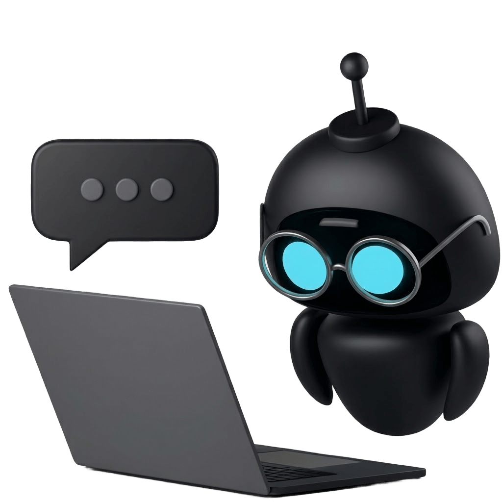
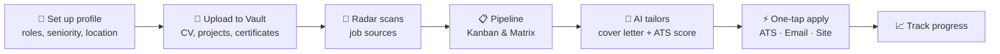
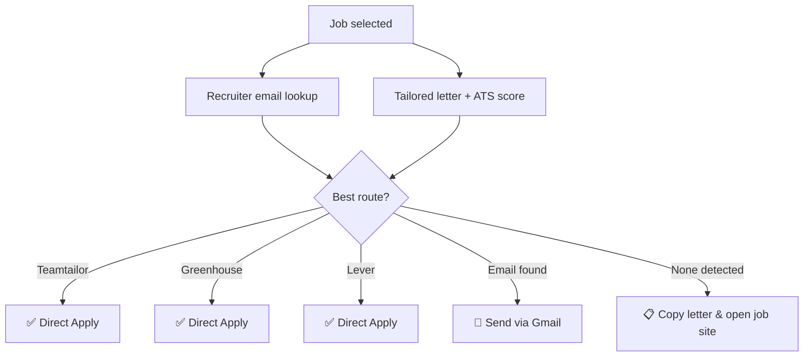
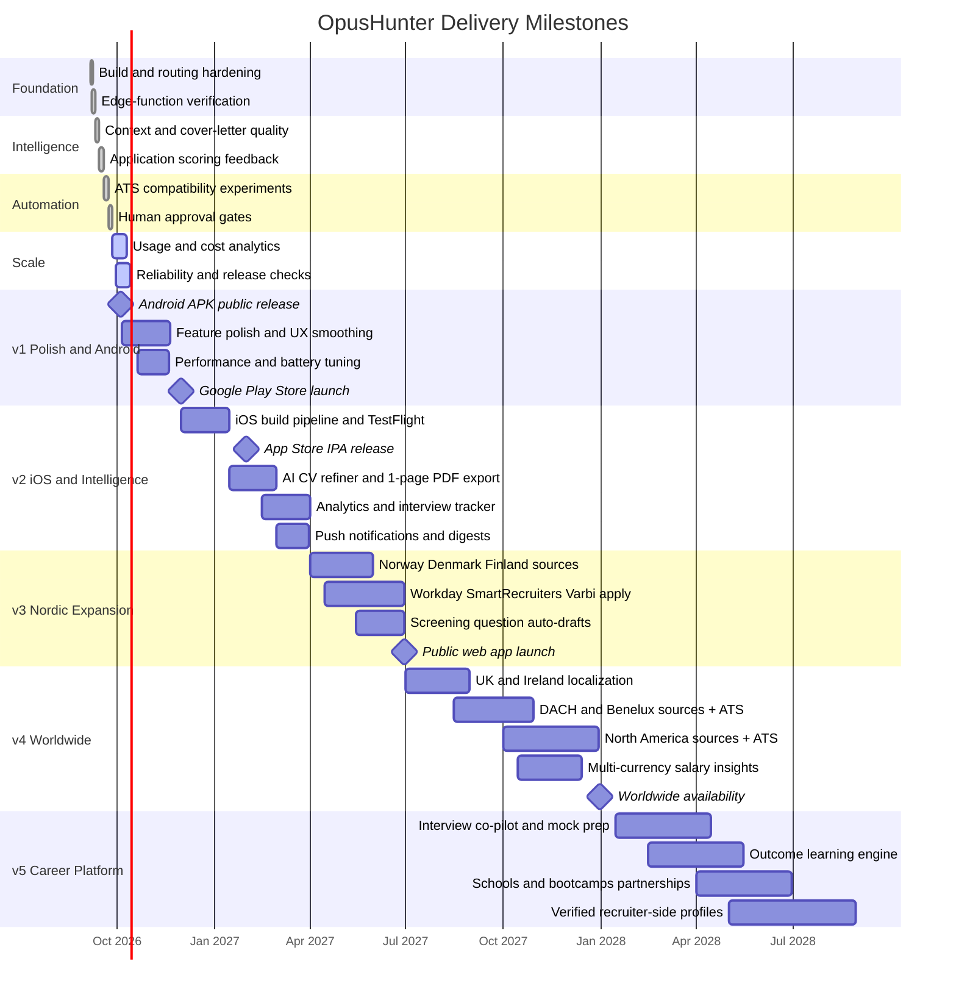

# OpusHunter

### Your autonomous job application co-pilot.

**Discover jobs. Generate tailored, evidence-based applications. Apply in one tap.**
 
Built for the global market — perfected first in Sweden 🇸🇪 and the Nordics.

 

 

  

&nbsp;

 

---

## 📑 Contents

- [Why OpusHunter](#-why-opushunter)
- [Download & Install](#-download--install)
- [How It Works](#-how-it-works)
- [Feature Highlights](#-feature-highlights)
- [Job Sources](#-job-sources)
- [One-Tap Apply Routes](#-one-tap-apply-routes)
- [Privacy & Control](#-privacy--control)
- [Release Notes](#-release-notes)
- [Roadmap](#-roadmap)
- [Milestones](#-milestones)
- [Long-Term Vision](#-long-term-vision)
- [FAQ](#-faq)
- [Support & Feedback](#-support--feedback)

---

## 💡 Why OpusHunter

Job hunting today is fragmented: a dozen job boards, scattered documents, browser tabs, spreadsheets, and the same cover letter rewritten fifty times. Most of it is repetition — and generic applications get filtered out by ATS systems anyway.

**OpusHunter replaces the grind with intelligent, evidence-grounded automation:**

<table>
<tr>
<td width="33%" align="center">

### 🔭
**Discover**
 
Aggregates jobs from Swedish, Nordic and global sources into one clean, deduplicated pipeline.

</td>
<td width="33%" align="center">

### 🧠
**Tailor**
 
Writes cover letters grounded in *your real* projects, certifications and experience — never invented claims.

</td>
<td width="33%" align="center">

### ⚡
**Apply**
 
Detects the best route — ATS, recruiter email or job site — and applies in a single tap.

</td>
</tr>
</table>

> **Controlled automation, not blind automation.** You decide what gets generated, what gets sent, and where. OpusHunter does the heavy lifting.

---

## 📲 Download & Install

| Platform | Status | Get it |
| :--- | :---: | :---: |
| 🤖 **Android (APK)** | ✅ Available | [**Latest Release →**](../../releases/latest) |
| ▶️ **Google Play Store** | 🚧 In preparation | Coming soon |
| 🍎 **iOS (App Store)** | 🗓️ Planned | Coming later |
| 🌐 **Web App** | 🧪 Preview | Coming soon |

### Installing the APK on Android

1. Open the [**latest release**](../../releases/latest) on your phone.
2. Under **Assets**, tap the file named `OpusHunter-vX.Y.Z.apk` to download it.
3. When prompted, allow your browser or file manager to **install unknown apps** (Settings → Apps → Special access → Install unknown apps).
4. Open the downloaded file and tap **Install**.
5. Launch **OpusHunter**, sign in with email or Google, and complete your profile.

> [!TIP]
> Updating? Just install the newer APK over the old one — your account and data live in the cloud and stay intact.

> [!NOTE]
> Android may show a "Play Protect" notice for apps installed outside the Play Store. This is expected for direct APK releases. The Google Play version will remove this step.

**Requirements:** Android 8.0 (Oreo) or newer · Internet connection · A Google or email account.

---

## 🔄 How It Works

1. **Tell OpusHunter who you are** — target roles, seniority, preferred cities or remote.
2. **Fill your Document Vault** — your CV, your project archives (`.zip`) and your certificates. OpusHunter reads them deeply to understand what you have *actually* built.
3. **Let the Radar run** — fresh jobs are pulled in, normalized and deduplicated automatically.
4. **Triage your pipeline** — swipe through Kanban columns or scan the dense Matrix view.
5. **Generate & review** — get a tailored, native-language cover letter with a real ATS match score.
6. **Apply** — one tap. OpusHunter picks the strongest route available.

---

## ✨ Feature Highlights

### 🧠 Evidence-Grounded AI Cover Letters
- **Your projects lead the story.** OpusHunter analyses every uploaded project archive and picks the one that best matches the listing as the centerpiece — then cites your wider portfolio to show breadth.
- **Certifications count.** Diplomas and certificates are read for their full curriculum (e.g. Java, Spring Boot, REST APIs, Docker) and woven into the letter and the ATS score.
- **Stack discipline.** Applying for a React role? It won't ramble about backend locking. Applying for Java backend? It focuses on services, concurrency and persistence.
- **Zero hallucination policy.** No invented employers, technologies or metrics — every claim traces back to your own documents.
- **Native-language writing.** Fluent, idiomatic Swedish and English (plus German, French, Spanish and more) with localized sign-offs — not literal translations.
- **350–500 words** of substance, in clean prose. No filler, no clichés.

### 🎯 Real ATS Scoring
- Deterministic scoring of how well a letter matches the listing's required skills, qualifications, languages and seniority.
- Specificity score and **filler-phrase detection** ("I am passionate about…", "många bollar i luften") so your letter stands out.
- A dictionary of hundreds of skill synonyms — including Swedish tech vocabulary (`programmering`, `webbutveckling`, `informationssäkerhet`).

### 📋 Smart Job Pipeline
- **Kanban board** to move jobs from *Discovered* → *Applied* → *Interview* and beyond.
- **Matrix view** for fast, dense triage of many listings.
- **SHA-256 deduplication** — the same job from three sources shows up once.

### 📂 Document Vault
- Store multiple CVs and mark a primary one.
- Upload entire **project archives** — OpusHunter extracts architecture, features and achievements.
- Upload **certificates & diplomas** with issuer, date and verified curriculum.
- Your original documents stay immutable.

### 📧 Recruiter Discovery
- Silently searches for the right recruiter or hiring mailbox the moment you open a job.
- Ranks dedicated hiring addresses (`careers@`, `jobb@`, `hr@`) above generic inboxes.
- Pre-fills the address and promotes **Send via Gmail** to a one-tap action.

### 🎨 Designed to Feel Premium
- Dark obsidian & cyan interface with frosted glass surfaces.
- A calm, natural lightning atmosphere in the background — tuned to stay smooth and cool on real devices.
- Large, accessible touch targets and ergonomic layouts (destructive actions always far right).

---

## 🌍 Job Sources

| Source | Region | What you get |
| :--- | :--- | :--- |
| 🇸🇪 **JobTech / Arbetsförmedlingen** | Sweden | The national public employment database |
| 🇸🇪 **SweClockers** | Sweden | Sweden's premier IT community job board |
| 🚀 **The Hub** | Nordics | Startup and scale-up roles across the Nordics |
| 💼 **LinkedIn** | Global | High-yield corporate & technical roles |
| 🌐 **Adzuna** | Global | UK, US, Europe and beyond |
| 🌐 **JSearch** | Global | Wide aggregated coverage |

More sources are on the [roadmap](#-roadmap).

---

## ⚡ One-Tap Apply Routes

OpusHunter detects the best way to apply for each job and promotes it as the primary action:

| Route | How it works |
| :--- | :--- |
| **Teamtailor** | Your CV and tailored letter are prepared and submitted directly |
| **Greenhouse** | Direct submission with question auto-fill and attachments |
| **Lever** | Direct submission to the employer's Lever board |
| **Gmail** | Sends a polished application from *your own* Gmail with CV attached |
| **Job site handoff** | Letter copied to clipboard, listing opened — nothing is ever falsely marked as "submitted" |

---

## 🔒 Privacy & Control

- **You approve every send.** Nothing is submitted or emailed without your explicit confirmation.
- **Your email, your identity.** Gmail is linked separately from login, using Google's official OAuth — OpusHunter can only *send* the applications you approve.
- **Row-level security.** Your documents and data are isolated to your account at the database level.
- **Honest status.** Opening a job site is never recorded as an application.
- **Bring your own key (optional).** Power users can add their own AI key for unlimited generation.

---

## 📝 Release Notes

<b>v1.0.0 — First public release</b>

 

**New**
- Multi-source job Radar (JobTech, SweClockers, The Hub, LinkedIn, Adzuna, JSearch)
- Kanban & Matrix pipeline views with deduplication
- Document Vault for CVs, project archives and certificates
- AI cover letters where your **projects and certifications lead the narrative**
- Full portfolio awareness — every uploaded project is considered, not just the first
- Certificate curriculum included in letters and ATS scoring
- Deterministic ATS score with filler-phrase detection
- One-tap apply via Teamtailor, Greenhouse, Lever and Gmail
- Silent recruiter email discovery
- Google sign-in and native Gmail linking on Android

**Polish**
- Smooth, flicker-free cards and background on Android
- Fixed squished buttons in the Quick Apply sheet
- Stable sessions without redirect loops

> Full history lives on the [**Releases**](../../releases) page.

---

## 🗺️ Roadmap

```mermaid
flowchart LR
    subgraph Q4["🟢 Now — v1.x"]
        A1["Android APK release"]
        A2["Google Play launch"]
        A3["Outlook email sending"]
        A4["In-app update notifier"]
    end
    subgraph Q1["🔵 Next — v2.0"]
        B1["iOS App Store"]
        B2["AI CV refiner + 1-page export"]
        B3["Application analytics"]
        B4["Interview tracker & reminders"]
    end
    subgraph Q2["🟣 Later — v3.0"]
        C1["Workday · SmartRecruiters · Varbi"]
        C2["Auto-answer screening questions"]
        C3["Salary insights"]
        C4["Web app public launch"]
    end
    Q4 --> Q1 --> Q2
```

### 🟢 Now — v1.x
- [x] Android APK public release
- [x] Projects & certifications as primary cover-letter evidence
- [ ] **Google Play Store** launch
- [ ] Outlook / Microsoft 365 sending
- [ ] In-app "new version available" notice
- [ ] Push notifications for new matching jobs

### 🔵 Next — v2.0
- [ ] **iOS** release on the App Store
- [ ] **AI CV Refiner** — rewrites your CV around your strongest projects and keeps it to one page, exported as PDF
- [ ] **Application analytics** — response rate per source, role and letter style
- [ ] **Interview tracker** with calendar reminders and prep notes
- [ ] Follow-up email suggestions after X days of silence
- [ ] Saved searches with daily digests

### 🟣 Later — v3.0
- [ ] More direct-apply ATS: **Workday, SmartRecruiters, Varbi, ReachMee, Jobylon**
- [ ] AI-drafted answers for screening questions, reviewed by you
- [ ] Salary ranges & market insights per role and city
- [ ] More Nordic sources (Finland 🇫🇮, Norway 🇳🇴, Denmark 🇩🇰)
- [ ] Public web app

---

## 📅 Milestones

---

## 🔭 Long-Term Vision

OpusHunter aims to become **the operating system for a job search** — from the first search to the signed offer.

| Horizon | Goal |
| :--- | :--- |
| 🧭 **Career Intelligence** | Understand which of your projects and skills open the most doors, and suggest what to build or learn next. |
| 🤝 **Interview Co-Pilot** | Company research briefs, likely technical questions generated from the listing and your own projects, and mock interview practice. |
| 📊 **Outcome Learning** | Learn from which applications get responses and continuously sharpen letters, targeting and timing. |
| 🌐 **Global Expansion** | Localized sources, languages and ATS integrations for the UK, DACH, Benelux and North America. |
| 🏫 **Schools & Bootcamps** | Help graduates turn certificates and course projects into job-winning portfolios. |
| 🧑‍💼 **Recruiter Side** | A verified-evidence candidate profile recruiters can trust — real projects, real credentials. |
| 🔐 **Trust by Design** | Always candidate-approved, transparent and honest about what was sent and where. |

---

## ❓ FAQ

<b>Is OpusHunter free?</b>

 
The core app is free to use with a fair daily quota for AI generation. Power users can add their own AI key for unlimited use. Premium plans may arrive later — existing features will not be locked away.

<b>Will it apply to jobs without asking me?</b>

 
No. Every application and email requires your confirmation. OpusHunter prepares everything — you press send.

<b>Does the AI make things up about me?</b>

 
No. Letters are grounded only in your profile, CV, uploaded projects and certificates. If it isn't in your documents, it isn't in your letter.

<b>Which languages can it write in?</b>

 
Swedish and English are first-class, with native phrasing. German, French, Spanish and other languages are supported too.

<b>Why isn't it on Google Play yet?</b>

 
The Play Store release is being prepared. Until then, the APK on the Releases page is the official build.

<b>Is it only for software developers?</b>

 
No. Letters adapt to the profession in the listing. Tech roles get extra depth thanks to project-archive analysis.

---

## 💬 Support & Feedback

Found a bug or have an idea? Your feedback directly shapes the roadmap.

- 🐞 **Report a bug** → [Open an issue](../../issues/new)
- 💡 **Suggest a feature** → [Start a discussion](../../issues/new)
- ⭐ **Like OpusHunter?** Star the repo to follow new releases

---

**OpusHunter** — Stop applying harder. Start applying smarter.

© 2026 OpusHunter. All rights reserved. Made in Sweden 🇸🇪

